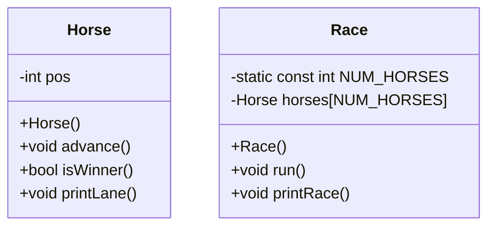

# OOP-HorseRace
Joseph Kloepper - OOP HorseRace for CSC121


```mermaid
classDiagram
    class Horse {
        -int pos
        +Horse()
        +void advance()
        +bool isWinner()
        +void printLane()
    }
    class Race {
        -static const int NUM_HORSES
        -Horse horses[NUM_HORSES]
        +Race()
        +void run()
        +void printRace()
    }
```
# Algorithm 
Test number one :)
```
