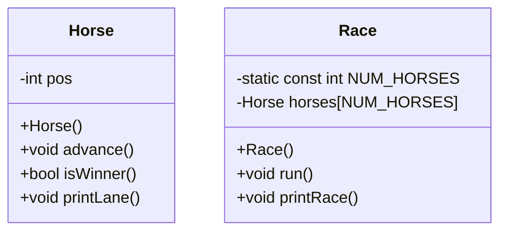

# OOP-HorseRace
Joseph Kloepper - OOP HorseRace for CSC121


# Algorithm 
(Horse Class)
 void Horse::advance()
    Will generate a random number 1-100
    If that number is even, add 1 to the horses position. 
    Otherwise, return nothing. 

void Horse::isWinner()
    if the horses position is >= 14
        reutrn true
    Otherwise, return false.

void Horse::printLane()
    Loop through the entire horse track.
    If index == pos
        print horse number.
    Otherwsie, print a dot. 

(Race Class)
void Race::run()
    Set keepGoing to true
        While keepGoing is true:
            Call the advance and printRace functions once per turn.
        If the isWinner function comes back true:
            Declare the winner. 
            Set keepGoing to false. 

Void Race::printRace()
    Loop through each horse.
    Call the printLane function.  

main()
    Create a Race object.
    Call the run() method within Race.     
```
